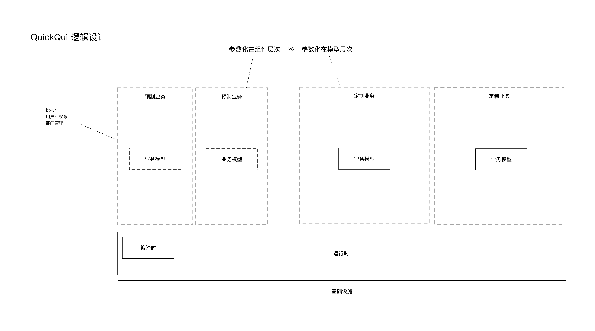

# QuickQui

快速业务原型项目

🥚🐣🐥

## 目标

系统设计者的工具。用于支持与客户的充分沟通。对业务和需求进行尽快的、尽可能一致的定义。

1. 快速搭建业务原型。
   1. 业务原型不是操作界面原型。
   2. 快速定义业务模型，首先表现为数据模型定义。
   3. 基本功能自动生成，用于展现业务概念 - 表单和CRUD、报表和图表、工作流、接口和事件。
2. 快速取得反馈。
   1. 实际可运行的原型。
      1. 广泛可达，支持多用户实际操作，比如部署到云。
      2. 基本的操作容错，比如数据权限控制。
      3. 起码的用户体验，界面符合基本审美。
   2. 快速迭代与可修改。
3. 快速获取生意。
   1. 原型可以快速转换为可投产的系统。

## 设计

### 逻辑设计

如下图。

### 现阶段实现设计

如下图。  
其中要点有 - 

1. 目前没有单独的业务层定义，直接借用数据定义。

## 实现

### 技术栈

1. GraphQL
2. Prisma
2. React
3. React-admin

### 子项目

1. prototype
2. model-server

## Liscense