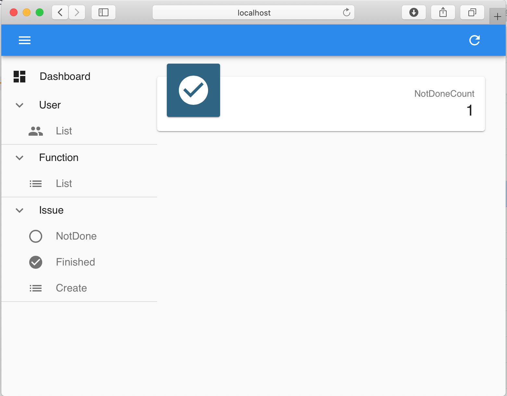

# 快速开始

## 生成模型项目

`npm init @quick-qui/model-project` 或者 `npx @quick-qui/create-model-project`
实际上都是运行的@quick-qui/create-model-project这个包。

命令将生成一个目录，目录名由您输入的包名决定。这个目录是 model-project 目录，也就是包含了模型的目录。模型开发和实现开发将在这个目录进行。

参见 [@quick-qui/create-model-project](https://github.com/quickqui/create-quick-qui)

## 模型开发和实现开发

对模型和实现进行修改和开发，以形成自己需要需要的系统。这里是实际开发时的主要工作步骤，但在此“快速开始”文档中先跳过。上一步生成的目录中，有内置的一个项目内容——一个简单的”Issue 管理系统“。

`cd <project-name>`

参见[使用说明 - 模型开发](use/model.md)、[使用说明 - 实现开发](use/impl.md)

## 生成成品

俗称“打包”。将模型和实现进行最终结合，生成可运行的“包”。

`DIST_DIR=../<dist> npx @quick-qui/builder`

这个命令将把成品生成在../dist 里面。默认的，将生成 npm 类型的成品。

参见[使用说明 - 生成成品](use/build.md)

## 运行成品

由于生成的是 npm 类型的成品，你需要 node 和 npm 来运行成品。

`cd ../<dist>`

`npm start`

