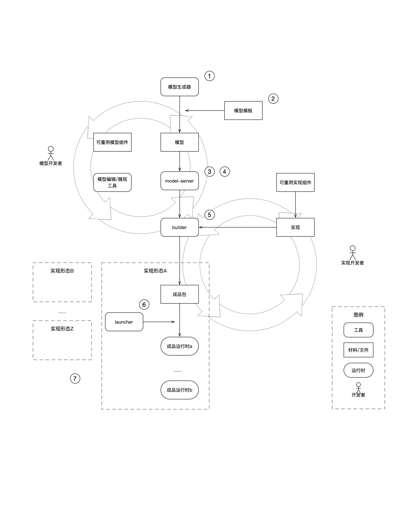

# 工作原理

## 概览图

## 概要说明

结合上图，对机制中的各部分进行介绍如下。

1. 模型生成器 - 生成一个模型项目。详细见 [@quick-qui/creater](http://github.com/quickqui/creater)
2. 模型模版 - 预定义的模型项目，作为模版用于生成模型项目。作为模型开发的起点。详细见 [@quick-qui/prototype](http://github.com/quickqui/prototype)
3. model-server - 对模型进行解析、组合、“编织”的处理器。详细见 [@quick-qui/model-server](http://github.com/quickqui/model-server)
4. 模型的自定义、可重用、可组合等关键机制在model-server运行，但不在model-server定义。详细见 [@quick-qui/model-defines](http://github.com/quickqui/model-defines)
5. builder - 将模型与实现相结合，生成可供运行的“成品包”
   1. 详细见 [@quick-qui/builder](http://github.com/quickqui/builder)
6. launcher - 负责将“成品包”实际运行，启动为一个或过个“成品运行时“，这些运行时协同工作，即为系统。
7. 实现形态有多种，也就是通过builder可以构筑多种”成品包“和运行为多种“成品运行时”的组合，以适应不同的环境和技术栈运行。
